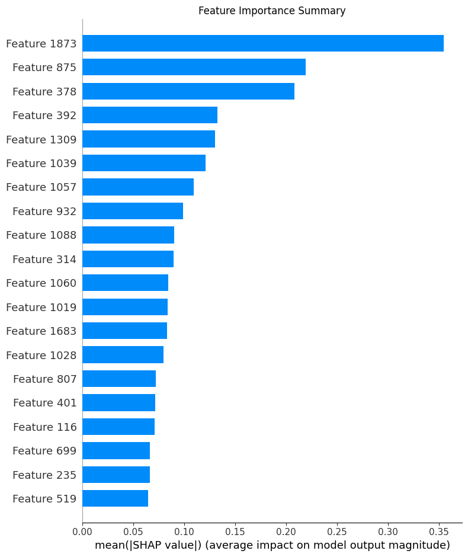

# AI-Driven-Toxicity-Prediction


## Overview
This project utilizes machine learning models to predict chemical toxicity based on molecular features. The dataset used is the **Tox21 dataset**, a widely used benchmark dataset for toxicity prediction.

# Importance of AI-driven toxicity prediction using the Tox21 dataset

AI-driven toxicity prediction using the **Tox21 dataset** is crucial for several reasons, especially in **drug discovery, environmental safety, and chemical risk assessment**. Here’s why it matters:

### 1. **Accelerates Drug Discovery & Development**  
   - AI models trained on the **Tox21 dataset** can predict whether new compounds are toxic before expensive laboratory testing.
   - Reduces **drug failure rates** in clinical trials by identifying potential toxic effects early.

### 2. **Reduces Animal Testing**  
   - Traditional toxicity testing relies on animal experiments, which are **expensive, time-consuming, and ethically controversial**.
   - AI models provide an **alternative in silico approach**, minimizing the need for animal-based studies.

### 3. **Enhances Chemical Safety & Environmental Protection**  
   - Helps in assessing the **toxicity of industrial chemicals, pesticides, and consumer products**.
   - Supports **regulatory bodies (EPA, FDA, ECHA)** in making data-driven decisions on chemical safety.

### 4. **Improves Predictive Accuracy with Machine Learning**  
   - The **Tox21 dataset** provides high-quality toxicology data for training AI models.
   - Deep learning and other ML techniques improve toxicity prediction by recognizing **complex molecular patterns**.

### 5. **Cost-Effective & Scalable**  
   - AI models can analyze thousands of compounds quickly, reducing the need for **expensive and slow wet-lab experiments**.
   - Enables rapid screening of large chemical libraries for toxicity risks.

### 6. **Facilitates Personalized Medicine**  
   - Helps predict how individuals may respond to **drugs based on toxicity risk**, aiding in **precision medicine**.


## Features
- **Dataset:** Tox21 dataset from DeepChem
- **Models Used:** Random Forest, XGBoost
- **Model Evaluation:** ROC curves, SHAP analysis
- **Feature Importance Analysis:** SHAP values for model interpretability

## Installation
To run this project, install the required dependencies:
```bash
pip install deepchem rdkit-pypi shap xgboost scikit-learn matplotlib
```

## Procedures
1. **Load Dataset:** Fetch the Tox21 dataset using DeepChem.
2. **Data Preprocessing:** Extract features, labels, and molecular representations.
3. **Train-Test Split:** Split the dataset into training and testing sets.
4. **Model Training:** Train **Random Forest** and **XGBoost** classifiers.
5. **Model Evaluation:** Compute the ROC AUC score and plot ROC curves.
6. **SHAP Analysis:** Use SHAP to explain model predictions and feature importance.

## Graph Analysis
- **ROC Curve:** Evaluates model performance by showing the trade-off between sensitivity and specificity.
- **SHAP Summary Plot:** Displays feature importance and how features influence predictions.

## SHAP Results Interpretation
- The SHAP summary plot highlights the most influential features in predicting toxicity.
- A bar plot of SHAP values provides a ranking of feature importance.
- These insights help in understanding how different molecular features contribute to toxicity predictions.



## Interpretation of the SHAP Summary Plot
Feature Importance Ranking

The y-axis lists the features ranked by their importance.
The x-axis represents the mean absolute SHAP values, which quantify the average impact of each feature on the model’s output.
Key Features Driving Model Predictions

Feature 1873 has the highest SHAP value, indicating it has the most significant impact on model predictions.
Features 875, 378, and 392 also play crucial roles but have a smaller impact than Feature 1873.
Lower-ranked features like 519, 235, and 699 have a comparatively lower impact.


## Summary
This project leverages AI techniques to predict toxicity levels based on molecular features. The combination of **DeepChem, machine learning models, and SHAP explainability** provides a comprehensive approach to toxicity prediction.

## Future Improvements
- Experiment with additional models such as neural networks.
- Enhance feature engineering for improved accuracy.
- Deploy the model as an API for real-world applications.

## Authors
Nnaemeka G. Anyadike

## License
This project is open-source and available under the MIT License.


